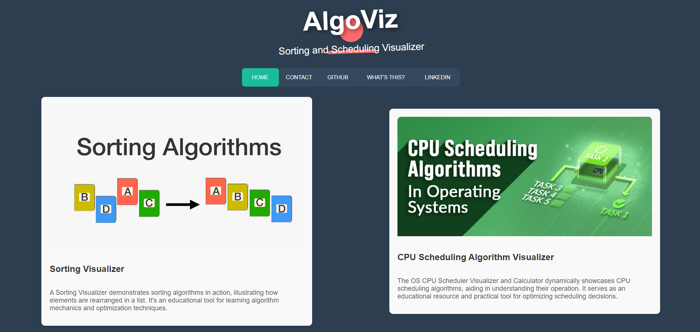
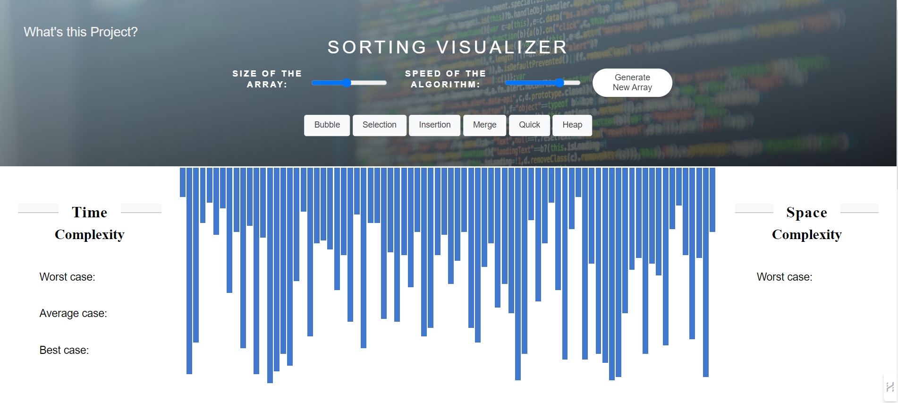
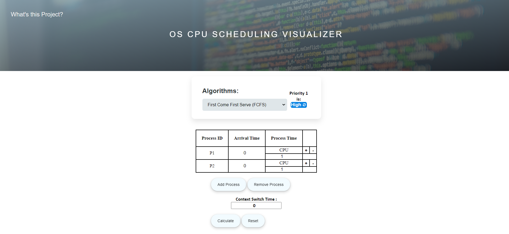

# AlgoViz

Embark on a journey through computing efficiency with Sorting and CPU Scheduling Visualizers. Witness sorting algorithms in action and explore CPU scheduling dynamics in real-time. Gain insights into computational efficiency and operating system performance with these interactive tools.

## Sorting Visualizer Features:

- **Visualization with color-coded steps:**
  - Blue: Default state
  - Yellow: Elements being compared
  - Red: Elements incorrectly positioned, marked for movement
  - Green: Elements in the correct position
- **Adjustable visualization controls:**
  - Speed settings (5 different levels)
  - Data size adjustments
  - Option to generate new random data
- **Display of time and space complexities for the algorithm being showcased.**

## Six Sorting Algorithms: 
- Bubble Sort,
- Insertion Sort, 
- Selection Sort, 
- Heap Sort, 
- Merge Sort, and 
- Quick Sort.

## CPU Scheduling Visualizer Features:

- **User Input Interface:**
  - The interface offers fields for process ID, arrival time, and burst time, accommodating multiple processes efficiently, thus enabling seamless input management.
- **Final Table:**
  - Presenting a comprehensive breakdown, the final table meticulously showcases arrival time, burst time, completion time, turnaround time, and waiting time for each process, ensuring a thorough analysis of scheduling outcomes.
- **Gantt Chart:**
  - With clarity and precision, the Gantt chart visually articulates the sequence of process executions, providing an intuitive understanding of system operation over time.
- **Timeline Chart:**
  - Through a graphical representation, the timeline chart vividly illustrates the scheduling period, delineating active processing periods and idle intervals, facilitating insightful observation of system behavior.
- **Time Log:**
  - Offering detailed insight into process execution, the time log provides a visual representation of each process's activity, enhancing comprehension of system dynamics and performance.

## Nine Scheduling Algorithms: 
- First Come First Serve (FCFS)
- Shortest Job First (SJF)
- Longest Job First (LJF) 
- Shortest Remaining Job First (SRTF)
- Longest Remaining Job First (LRTF)
- Round Robin
- Priority (Non Preemptive)
- Priority (Preemptive)
- Highest Response Ratio Next (HRRN)

## How to Use:

- Clone this repository to your local machine.
- Open the index.html file in your web browser.
- Select Sorting Visualizer or CPU Scheduling Visualizer.

